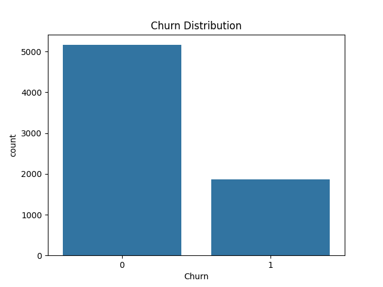
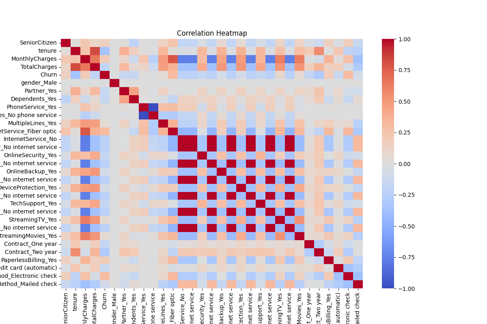

# Customer Churn Prediction using Machine Learning

## Overview

Customer churn is one of the biggest challenges faced by telecom companies. This project aims to predict whether a customer is likely to leave the service based on demographic information, account details, and service usage patterns.

Using machine learning techniques, the project analyzes customer behavior and identifies the key factors contributing to customer churn.

---

## Problem Statement

Telecommunication companies lose significant revenue when customers discontinue their services. Predicting customer churn helps businesses take proactive measures to retain customers and improve overall profitability.

The objective of this project is to build a machine learning model capable of predicting customer churn accurately.

---

## Dataset

**Dataset Used:** Telco Customer Churn Dataset

The dataset contains information about:

* Customer demographics
* Account information
* Service subscriptions
* Billing details
* Customer tenure
* Churn status

Target Variable:

* **Churn**

  * Yes → Customer left the service
  * No → Customer stayed with the service

---

## Technologies Used

* Python
* Pandas
* NumPy
* Matplotlib
* Seaborn
* Scikit-learn
* Jupyter Notebook

---

## Machine Learning Models Used

* Logistic Regression
* Decision Tree Classifier
* Random Forest Classifier

---

## Project Workflow

### 1. Data Collection

Loaded the Telco Customer Churn dataset for analysis.

### 2. Data Cleaning

* Handled missing values
* Removed inconsistencies
* Converted data types where necessary

### 3. Exploratory Data Analysis (EDA)

Performed visual analysis to understand customer behavior and churn trends.

### 4. Feature Engineering

* Converted categorical variables into numerical format
* Prepared features for machine learning algorithms

### 5. Data Preprocessing

* Encoding categorical variables
* Feature scaling where required
* Train-test split

### 6. Model Training

Trained multiple machine learning classification models.

### 7. Model Evaluation

Compared model performance using standard evaluation metrics.

### 8. Feature Importance Analysis

Identified the most influential factors affecting customer churn.

---

## Exploratory Data Analysis

The project includes various visualizations such as:

* Churn Distribution
* Correlation Heatmap
* Tenure Analysis
* Monthly Charges Analysis
* Customer Service Analysis

### Sample Visualizations





---

## Evaluation Metrics

The following metrics were used to evaluate model performance:

* Accuracy Score
* Confusion Matrix
* Precision
* Recall
* F1 Score
* Classification Report

---

## Results

The machine learning models successfully predicted customer churn patterns.

Among the trained models, the Random Forest Classifier provided the best overall performance and demonstrated strong predictive capability for identifying customers at risk of leaving the service.

---

## Key Insights

* Customers with shorter tenure are more likely to churn.
* Higher monthly charges are associated with increased churn probability.
* Contract type significantly influences customer retention.
* Certain service subscriptions impact customer loyalty.

---

## Project Structure

```text
customer-churn-prediction-ml/
│
├── data/
│   └── telco.csv
│
├── notebooks/
│   └── customer_churn_prediction.ipynb
│
├── images/
│   ├── churn_distribution.png
│   ├── correlation_heatmap.png
│
├── README.md
├── requirements.txt
├── .gitignore
├── project_overview.pdf
└── project_report.pdf
```

---

## Installation

Clone the repository:

```bash
git clone https://github.com/your-username/customer-churn-prediction-ml.git
```

Navigate to the project directory:

```bash
cd customer-churn-prediction-ml
```

Install dependencies:

```bash
pip install -r requirements.txt
```

---

## How to Run

Launch Jupyter Notebook:

```bash
jupyter notebook
```

Open:

```text
customer_churn_prediction.ipynb
```

Run all cells sequentially to reproduce the analysis and model training process.

---

## Future Improvements

* Hyperparameter tuning using GridSearchCV
* Model deployment using Streamlit
* Deep learning-based churn prediction
* Real-time customer churn monitoring dashboard

---

## Learning Outcomes

Through this project, I gained practical experience in:

* Data Cleaning
* Exploratory Data Analysis
* Data Visualization
* Feature Engineering
* Machine Learning Classification
* Model Evaluation
* Business Problem Solving using Data Science

---

## Author

**Pratham Chaudhary**

B.Tech CSE Student | Aspiring Data Scientist | Machine Learning & DSA Enthusiast

---

## License

This project is licensed under the MIT License.
